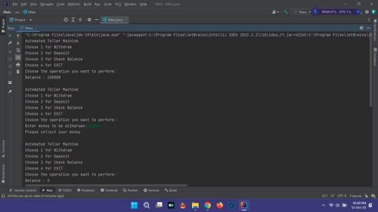
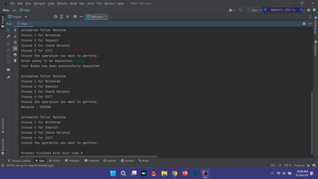

**ATM-- Automated Teller Machine **

- **First enter the choose 3 for check the balance.** 
- **Choose 1 for withdraw the money. After this enter the choose 3 for check the balance again. now, balance is zero (0).** 
- **Enter Choose 2 for depositing the money. After this enter the choose 3 for check the balance again. now, balance. **

**All operation works successfully. **
