#Employee-records# 

**Post for register new employee record** 

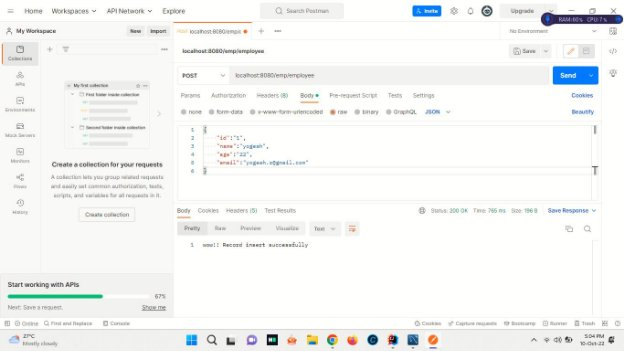

**Database** 

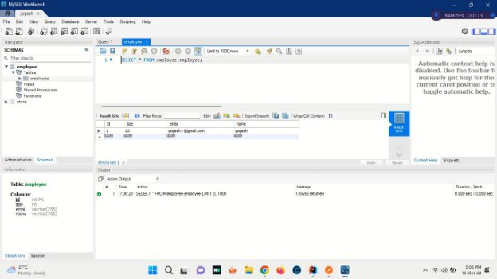

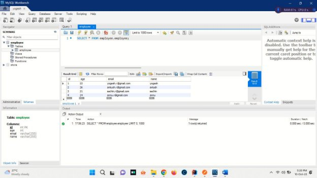

**Get for retrieving employee list** 

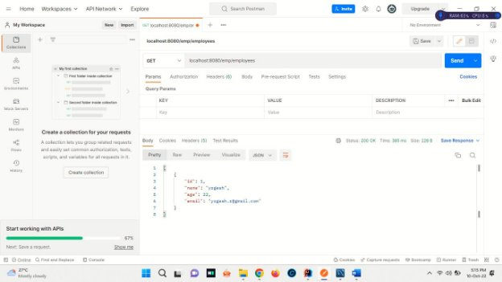

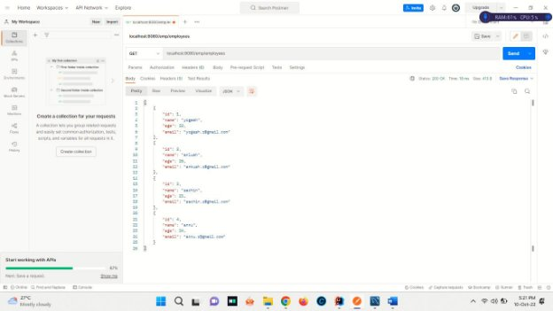

**Put for updating in the records** 

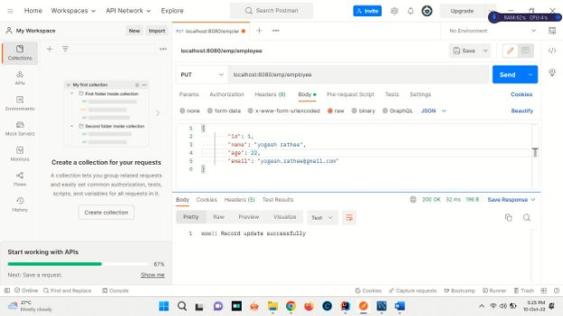

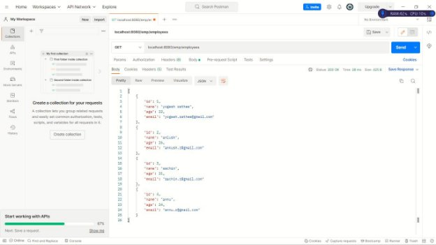

updating in the database 

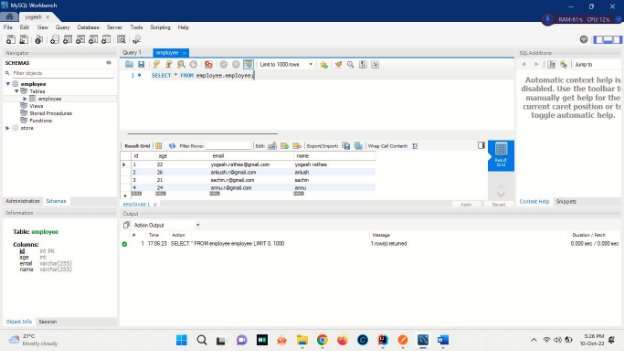

**Delete for deletion of record** 

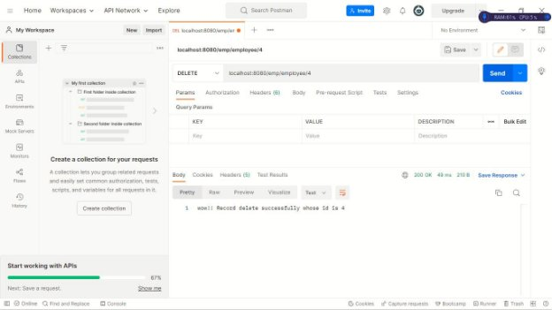

after deletion 

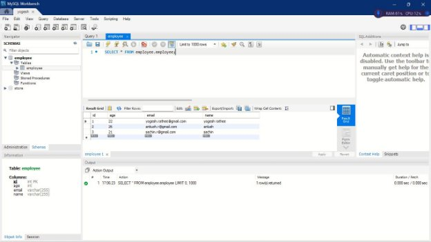

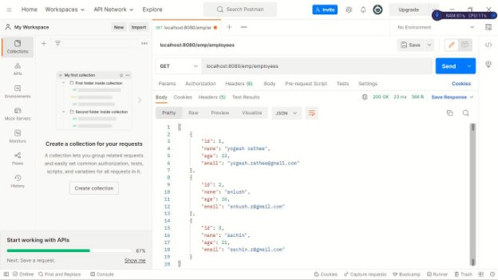

**JUnit test cases: - **

1. testCreateEmployee 

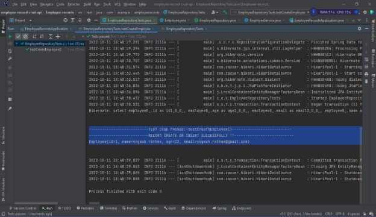

2. testFindEmployeeByName 

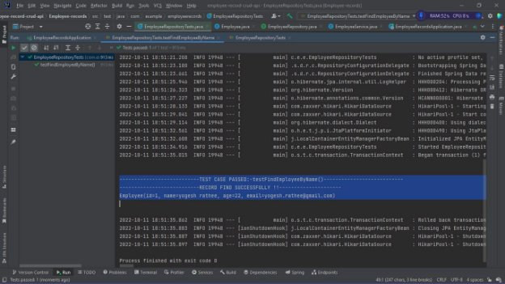

3. testListEmployee 

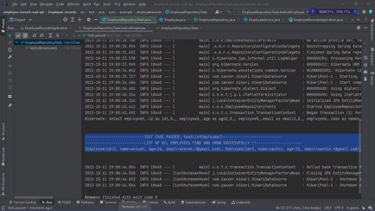

4. testUpdateEmployee 

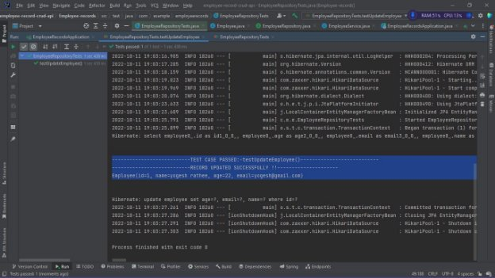

5. testDeleteEmployee 

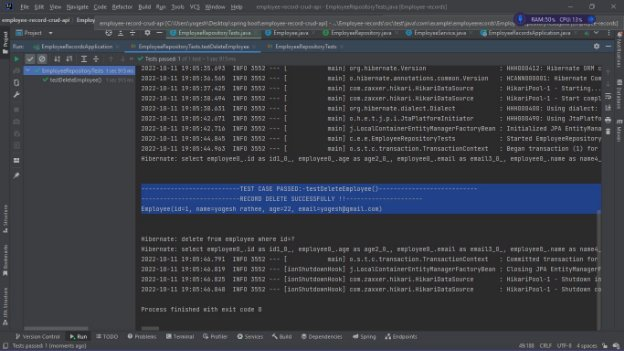

❖ **EmployeeRepositoryTests **

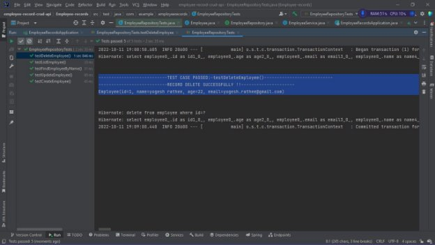

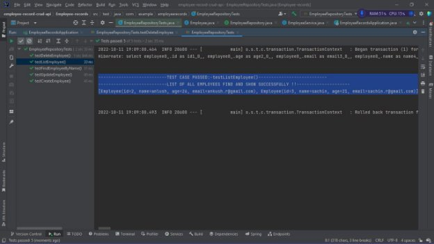

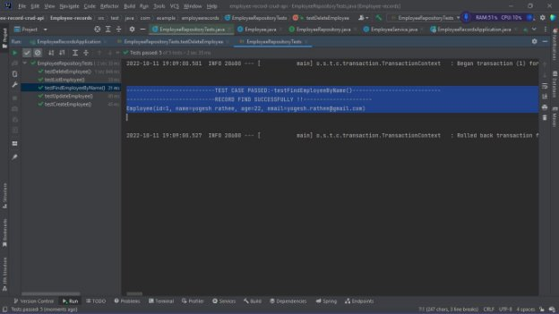

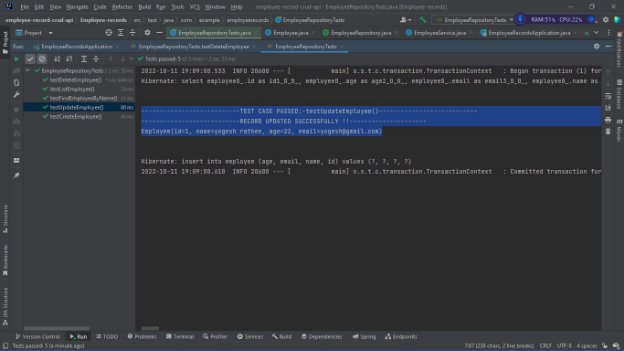

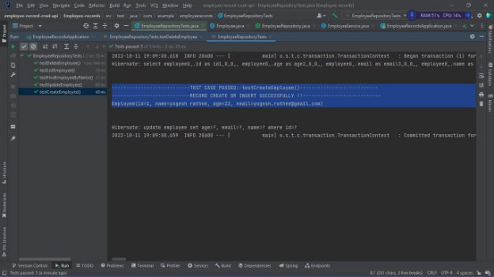

**Employee-records-CRUD-API  **

` `All test cases passed successfully. 
