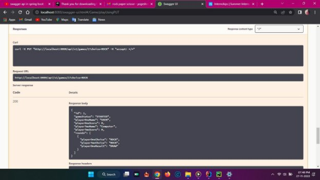
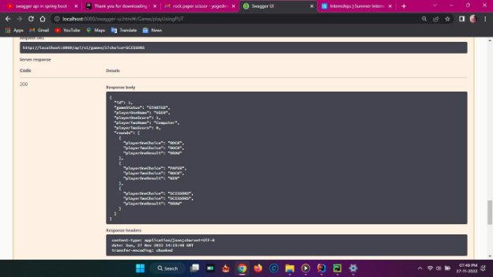
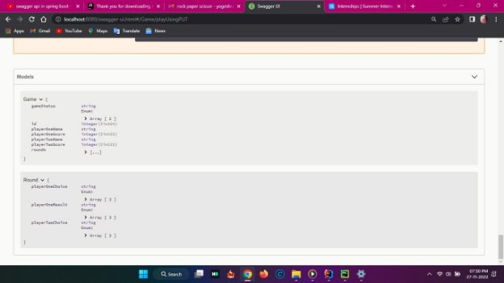

##Rock Paper Scissor  

This project is based on Spring boot application  

**#### Technology used** 

- Java 8 : programming language  
- Spring boot : Web application  
- H2 : In-Memory Database 
- Maven : Building project 
- Swagger : RESTful Documentation 

**#### Web Application configuration**  

- Web Application is running on port  8080  
- You can change the configuration in  application.properties  

**#### Steps to run the project** 

- Prerequisite 
  - Maven  
  - Java 8 or higher  
- Start the application 

Through following command: 

`    `mvn clean install spring-boot:run  

Maven will install all the dependencies and followed by run the application 

- To test the application 

`    `http://localhost:8080/swagger-ui.html 

**#### Architectural points and Terminologies used in the project** 

- Game rules 
  - Rock beats Scissors 
  - Scissors beats Paper 
  - Paper beats Rock 
- Modularise 

For the time being I have modularise the project on package level. Later we can also modularise in maven modules.     

- RESTful API design  

Backend consists RESTful APIs all starts with  /api/v1  because of following reasons: 

- Api versioning can be done in future. (followed java principle: Open for extension and closed for modification) 
- Trying out and documentation for RESTful APIs 

Swagger is already integrated and can be used for using API instead of curl.      http://localhost:8080/swagger-ui.html 

- Comments in code  

Entire code styling is influenced by Clean Code principle - Robert Martin Which says 

'Truth can only be found in one place: the code’. 

So you may not found any comments anywhere in the project. 

Keeping in mind that git can be used to versioning of file and method, class names should be kept as self explanatory. 

**EXECUTION:-** 

**POST: -** FOR STARTING THE GAME. 

**GET**:-FOR SHOWING THE STATUS OF GAME. 

**PUT**:-FOR PLAY GAME. 

**MODELS**:- 

**JUNIT TEST CASES: -** 

